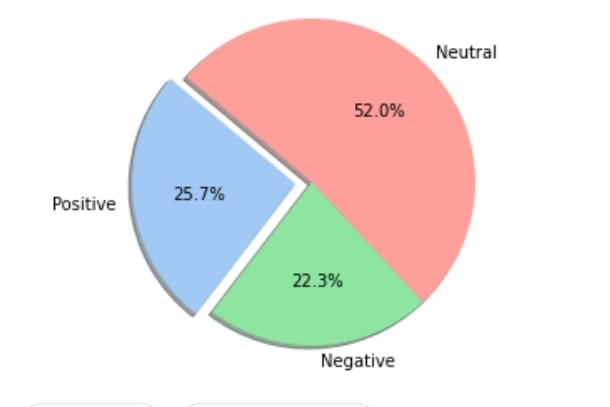
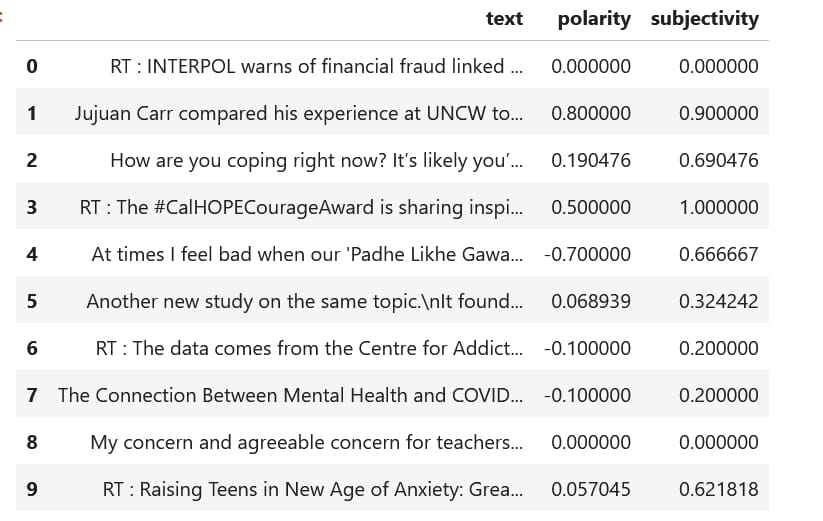
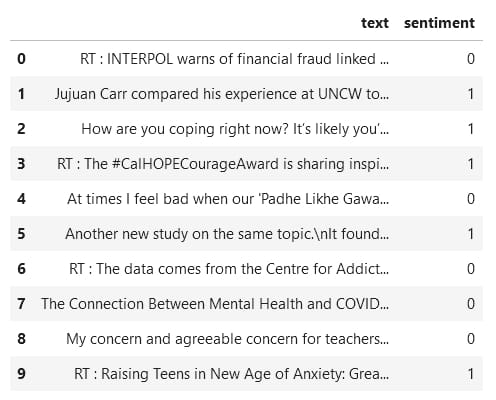
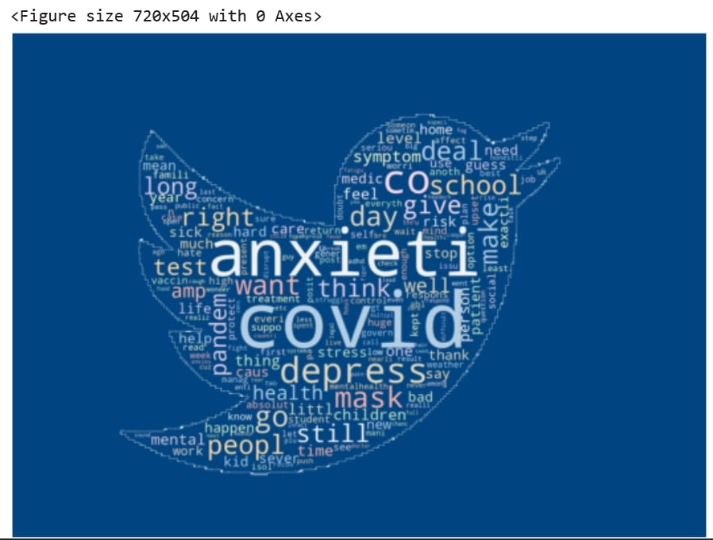
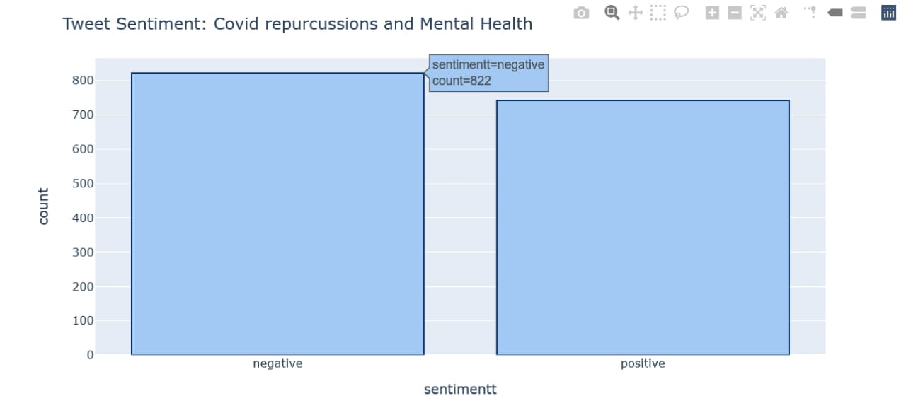
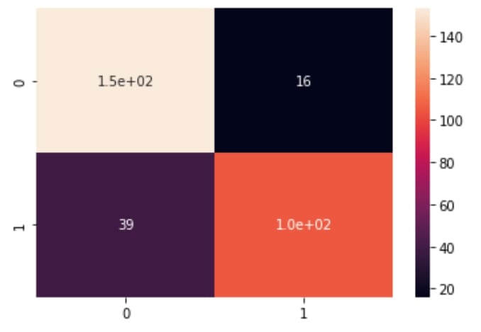
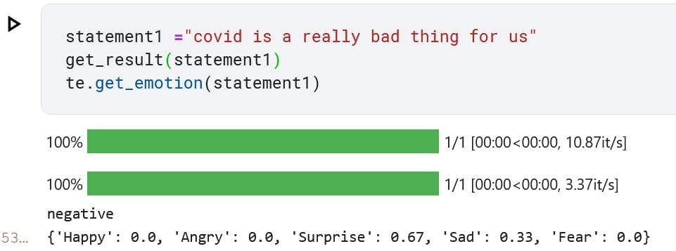
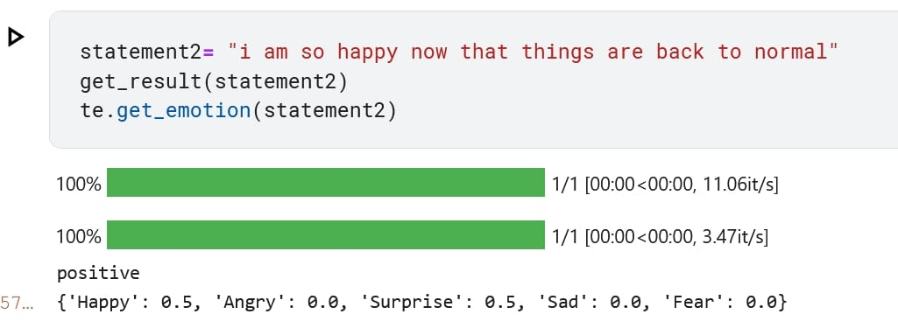
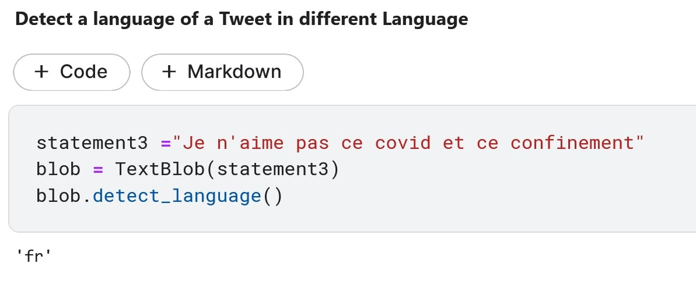
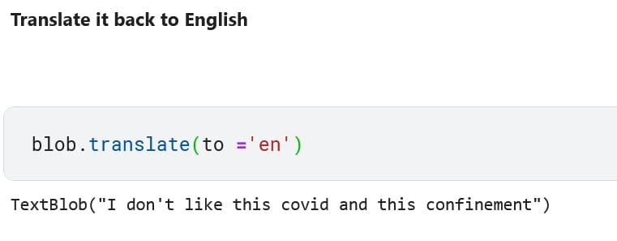

# Covid Based Tweet Analysis from scratch using BERT
BERT stands for Bidirectional Encoder Representations from Transformers. It's intended to use both left and right context conditioning to pre-train deep bidirectional representations from unlabeled text. As a result, with just one extra output layer, the pre-trained BERT model may be fine-tuned to generate state-of-the-art models for a wide range of NLP applications.

In other words, the BERT scans the entire sequence of words at once, unlike directional models that read the text input sequentially (left-to-right). As a result, it is classified as bidirectional. This feature enables the model to learn the context of a word from its surroundings (to the left and right of the word).

For the task of finding how covid has affected the mental health of people around the world, Tweets were extracted using tools like TWINT and TWEEPY.

TWINT is an advanced Twitter scraping tool written in Python that allows for scraping Tweets from Twitter profiles without using Twitter's API. Whereas, TWEEPY is an open source Python package that gives you a very convenient way to access the Twitter API with Python. Tweepy includes a set of classes and methods that represent Twitter's models and API endpoints, and it transparently handles various implementation details, such as: Data encoding and decoding.

The extracted datasets were stored in respective CSV files. The raw dataset had a lot of noise like hashtags, retweets, account handles (@s). Which were then cleaned and removed. Both the datasets after respective cleaning were then merged into one csv file.
This is what a raw analysis of dataset looked like.

After cleaning and merging, the next task was to determine the sentiment of the tweets. For that, first the POLARITY and SUBJECTIVITY of the tweets were determined. For that, The library TEXTBLOB was used.

Polarity is a float value which lies in the range of [-1,1] where 1 means positive statement and -1 means a negative statement. Subjective sentences generally refer to personal opinion, emotion or judgment whereas objective refers to factual information. Subjectivity is also a float which lies in the range of [0,1]. Subjectivity quantifies the amount of personal opinion and factual information contained in the text. The higher subjectivity means that the text contains personal opinion rather than factual information. TextBlob has one more parameter — intensity. TextBlob calculates subjectivity by looking at the ‘intensity’. Intensity determines if a word modifies the next word. For English, adverbs are used as modifiers (‘very good’)

This is what the updated dataset looks like:

The next task was to determine the sentiment, for that, the Polarity of text was considered, and the library TEXTBLOB was used. The below image describes the sentiment 0 as negative, and sentiment 1 as positive.

Then, some visualizations on the final Dataset were performed, like below.
Given below is a visualization that describes the most used words in our dataset. the library WORDCLOUD was used.

After some more data analysis, it was found that there are 822 tweets with negative sentiment and 742 tweets with positive sentiment.

Our dataset, now prepared for training, testing and prediction, was trained using BERT, that used simple transformers. The data was shuffled into training and testing datasets, and trained.

following is the confusion matrix for the dataset.

The accuracy was found to be 85%.

To see how the model did, given below are some predictions of our trained and tested model.

To calculate the emotions, we used the library text2emotion.

Now, supposing we have a tweet in a different language, to detect the language, and translate, we used the library TEXTBLOB.

So, these were the outputs of my model. Thank you.
